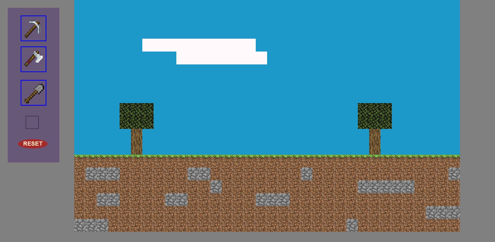

# Minecraft

Site's link :

https://2d-minecraft-i-think.netlify.app/

### 95% FINISHED

I have created a 2D minecraft game where you can clear the world and build new one as u wish!
But there is a catch , you can only use the last element in the inventory to build your new world.

## Things to know

You will have only 3 types of tools:

- Axe : for cutting trees and logs.
- Pickaxe : for mining rocks.
- Shovel : for digging dirt.

When you remove blocks , ONLY the last removed block will go to your inventory and you can use it once again.

Click on RESET to reset the game. 🐱‍👤

## Known bugs:

Removing a block then adding it then removing it allows u to put back the block only connected to other blocks
and you cant remove it again

# Preview of the game

